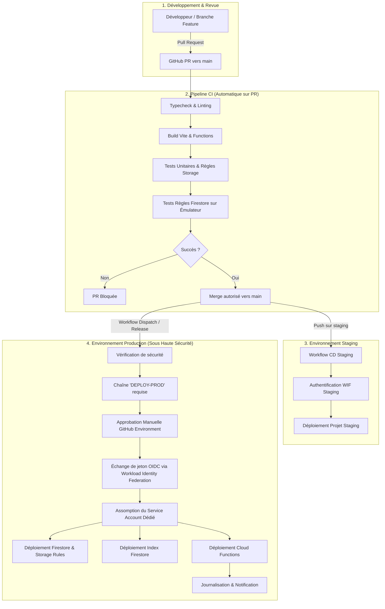

# Guide d'Architecture & Manuel Opérationnel CI/CD — ACTIVA HealthPass

Ce document constitue la référence officielle pour le déploiement sécurisé, l'automatisation CI/CD et l'observabilité de la plateforme **ACTIVA HealthPass** sur l'infrastructure Google Cloud Platform et Firebase.

---

## 1. Diagnostic du Système Initial & Risques Corrigés

| Composant | État Initial | Risque Identifié | Solution Apportée |
| :--- | :--- | :--- | :--- |
| **Authentification CI/CD** | Aucune (manuel) | Risque de fuite si `FIREBASE_TOKEN` permanent utilisé | **Google Cloud Workload Identity Federation (WIF)** sans clé statique |
| **Permissions IAM** | N/A (non configuré) | Risque d'utilisation de rôles trop larges (`Owner`/`Editor`) | **Service Account dédié** restreint aux seuls rôles Cloud Functions, Rules et Indexes |
| **Base Firestore** | Base nommée | Risque de déploiement sur la base `(default)` vide | Configuration explicite de `ai-studio-activahealthpass-...` dans `firebase.json` |
| **Index Firestore** | Aucun fichier dans le repo | Échecs de requêtes composites en production | Création et versioning de `firestore.indexes.json` |
| **Storage Rules** | `allow read, write: if request.auth != null;` | Écrasement/suppression de fichiers, uploads illimités | Durcissement avec types MIME, quotas de taille (5 Mo/15 Mo) et suppression Admin-only |
| **Environnements** | Alias unique `default` | Déploiement accidentel sans phase de staging | Ségrégation `.firebaserc` (`staging` vs `production`) + GitHub Environments protégés |
| **Cloud Functions** | Code écrit mais non déployé | Rupture du fallback local et claims désynchronisés | Workflow CD automatisé avec pré-compilation stricte et tests |

---

## 2. Schéma de l'Architecture CI/CD



---

## 3. Authentification Sécurisée : Workload Identity Federation (WIF)

Pour éliminer définitivement les clés de compte de service JSON téléchargeables (qui constituent la première cause de compromission de cloud), le pipeline utilise la fédération d'identité OpenID Connect (OIDC) entre GitHub Actions et Google Cloud Platform.

### 3.1. Commandes gcloud de Provisioning (à exécuter une seule fois par l'administrateur GCP)

```bash
# Variables d'environnement de configuration
export PROJECT_ID="gen-lang-client-0957905786"
export GITHUB_REPO="<ORGANISATION_OU_USER>/<NOM_DU_DEPOT>" # Ex: activa-assurances/healthpass
export POOL_NAME="github-actions-pool"
export PROVIDER_NAME="github-actions-provider"
export SA_NAME="sa-firebase-deployer"

# 1. Activer les APIs GCP requises
gcloud services enable \
  iamcredentials.googleapis.com \
  cloudfunctions.googleapis.com \
  firebaserules.googleapis.com \
  firestore.googleapis.com \
  firebasestorage.googleapis.com \
  artifactregistry.googleapis.com \
  cloudbuild.googleapis.com \
  --project="${PROJECT_ID}"

# 2. Créer le Compte de Service (Service Account) dédié au déploiement
gcloud iam service-accounts create "${SA_NAME}" \
  --display-name="CI/CD Firebase & Cloud Functions Deployer" \
  --project="${PROJECT_ID}"

# 3. Créer le Workload Identity Pool
gcloud iam workload-identity-pools create "${POOL_NAME}" \
  --project="${PROJECT_ID}" \
  --location="global" \
  --display-name="GitHub Actions Pool"

# 4. Créer le Workload Identity Provider OIDC pour GitHub
gcloud iam workload-identity-pools providers create-oidc "${PROVIDER_NAME}" \
  --project="${PROJECT_ID}" \
  --location="global" \
  --workload-identity-pool="${POOL_NAME}" \
  --display-name="GitHub Actions Provider" \
  --attribute-mapping="google.subject=assertion.sub,attribute.actor=assertion.actor,attribute.repository=assertion.repository" \
  --issuer-uri="https://token.actions.githubusercontent.com"

# 5. Autoriser uniquement votre dépôt GitHub à emprunter ce compte de service
export WORKLOAD_POOL_ID=$(gcloud iam workload-identity-pools describe "${POOL_NAME}" \
  --project="${PROJECT_ID}" \
  --location="global" \
  --format="value(name)")

gcloud iam service-accounts add-iam-policy-binding "${SA_NAME}@${PROJECT_ID}.iam.gserviceaccount.com" \
  --project="${PROJECT_ID}" \
  --role="roles/iam.workloadIdentityUser" \
  --member="principalSet://iam.googleapis.com/${WORKLOAD_POOL_ID}/attribute.repository/${GITHUB_REPO}"
```

---

## 4. Configuration IAM selon le Principe du Moindre Privilège

Le compte de service `sa-firebase-deployer` **ne dispose d'aucun rôle `Owner` ou `Editor`**. Il est strictement restreint aux autorisations techniques requises pour compiler et publier les artefacts Firebase :

```bash
export SA_EMAIL="${SA_NAME}@${PROJECT_ID}.iam.gserviceaccount.com"

# Rôle pour déployer les Cloud Functions
gcloud projects add-iam-policy-binding "${PROJECT_ID}" \
  --member="serviceAccount:${SA_EMAIL}" \
  --role="roles/cloudfunctions.developer"

# Rôle pour déployer les règles Firestore et Storage
gcloud projects add-iam-policy-binding "${PROJECT_ID}" \
  --member="serviceAccount:${SA_EMAIL}" \
  --role="roles/firebaserules.admin"

# Rôle pour déployer les index composites Firestore
gcloud projects add-iam-policy-binding "${PROJECT_ID}" \
  --member="serviceAccount:${SA_EMAIL}" \
  --role="roles/datastore.indexAdmin"

# Rôle pour gérer la configuration du bucket Storage
gcloud projects add-iam-policy-binding "${PROJECT_ID}" \
  --member="serviceAccount:${SA_EMAIL}" \
  --role="roles/storage.admin"

# Rôle pour construire les images conteneurs des Functions
gcloud projects add-iam-policy-binding "${PROJECT_ID}" \
  --member="serviceAccount:${SA_EMAIL}" \
  --role="roles/artifactregistry.writer"

# Rôle pour soumettre les builds Cloud Build lors du packaging des Functions
gcloud projects add-iam-policy-binding "${PROJECT_ID}" \
  --member="serviceAccount:${SA_EMAIL}" \
  --role="roles/cloudbuild.builds.editor"

# Autorisation d'agir en tant que compte de service d'exécution des Cloud Functions (App Engine default ou Compute)
export DEFAULT_FN_SA="${PROJECT_ID}@appspot.gserviceaccount.com"
gcloud iam service-accounts add-iam-policy-binding "${DEFAULT_FN_SA}" \
  --member="serviceAccount:${SA_EMAIL}" \
  --role="roles/iam.serviceAccountUser"
```

---

## 5. Configuration des Secrets et Variables GitHub Actions

Dans votre dépôt GitHub (**Settings** > **Secrets and variables** > **Actions**) :

### Variables d'Environnement (Repository Variables)
* `FIREBASE_PROJECT_ID` : `gen-lang-client-0957905786`
* `FIREBASE_PROJECT_ID_STAGING` : `gen-lang-client-0957905786-staging`

### Secrets (Repository Secrets ou Secrets d'Environnement)
* `GCP_WIF_PROVIDER` : `projects/<NUMERO_DE_PROJET>/locations/global/workloadIdentityPools/github-actions-pool/providers/github-actions-provider`
* `GCP_SERVICE_ACCOUNT` : `sa-firebase-deployer@gen-lang-client-0957905786.iam.gserviceaccount.com`

---

## 6. Protection contre les Déploiements Accidentels

1. **Règles de Protection de Branche (`main`)** :
   * Exiger une Pull Request avant merge.
   * Exiger au moins 1 approbation humaine.
   * Statut CI obligatoire : `Lint, Build & Security Test Suite` doit être au vert.
   * Interdire le push direct (`Include administrators`).
2. **Environnement GitHub `production`** :
   * **Required reviewers** : Définir les Tech Leads / RSSI autorisés à valider la mise en production.
   * **Wait timer** : Optionnel (ex: 5 minutes de délai de rétractation).
   * **Deployment branches** : Restreint exclusivement à la branche `refs/heads/main`.
3. **Double barrière logicielle dans le workflow** :
   * Saisie explicite du mot-clé `DEPLOY-PROD`.
   * Rejet immédiat si le déclencheur provient d'une branche non autorisée.

---

## 7. Procédures Opérationnelles de Déploiement

### Déploiement en Staging
```bash
# Automatique lors d'un push sur la branche 'staging' ou via GitHub Actions :
gh workflow run "CD — Déploiement Staging" --ref staging
```

### Déploiement en Production
1. Créer une Release GitHub officielle (ex: `v2.4.0`) **OU** déclencher manuellement le workflow :
   * Aller sur **Actions** > **CD — Déploiement Production (Sécurisé)**.
   * Cliquer sur **Run workflow**.
   * Champ de confirmation : entrer `DEPLOY-PROD`.
   * Choisir le périmètre (`all`, `rules-only`, `functions-only`, `indexes-only`).
2. Les relecteurs désignés reçoivent une notification pour approuver le déploiement sur l'environnement `production`.
3. Le pipeline exécute l'audit, build, authentification WIF et déploiement Firebase.

---

## 8. Procédures de Rollback d'Urgence

### Cas A : Régression sur les Security Rules (Firestore ou Storage)
Le déploiement des Security Rules est quasi-instantané (< 10 secondes).
1. **Via Git (Recommandé pour audit trail)** :
   ```bash
   git revert HEAD
   git push origin main
   # Puis déclencher le workflow en ciblant 'rules-only'
   ```
2. **Via Firebase Console (Urgence absolue)** :
   * Aller dans la console Firebase > **Firestore Database** > Onglet **Règles**.
   * Cliquer sur **Historique des versions**.
   * Sélectionner la version stable précédente et cliquer sur **Rétablir**.
   * Faire de même dans Firebase Storage > **Règles**.

### Cas B : Régression sur une Cloud Function
1. **Redéploiement du Commit Précédent** :
   * Sélectionner le tag ou commit stable précédent dans GitHub Actions et relancer le workflow CD avec `functions-only`.
2. **Gestion du Trafic Cloud Functions (Gen 2)** :
   * Les Cloud Functions Gen 2 tournent sur Cloud Run. Vous pouvez réassigner 100% du trafic à la révision précédente en quelques secondes via la console Cloud Run ou :
   ```bash
   gcloud run services update-traffic <NOM_DE_LA_FONCTION> \
     --to-revisions=<REVISION_PRECEDENTE>=100 \
     --region=europe-west3
   ```

### Cas C : Préservation des Données de Santé Firestore
* **Règle absolue** : Les scripts CI/CD ne doivent **JAMAIS** contenir de commande d'effacement de base (`firestore:delete`).
* Des sauvegardes planifiées automatiques (GCP Firestore Export) doivent être configurées quotidiennement vers un bucket Cloud Storage à conservation verrouillée (Object Retention Lock).

---

## 9. Checklist Go-Live

Avant d'ouvrir le trafic aux utilisateurs en production :

- [ ] Les 15 Cloud Functions compilent avec `npm --prefix functions run build` sans avertissement.
- [ ] La suite de tests unitaires et de règles passe au vert (`npm test` et `npm run test:rules`).
- [ ] Le Workload Identity Federation Provider et le Service Account sont créés sur GCP.
- [ ] Les secrets `GCP_WIF_PROVIDER` et `GCP_SERVICE_ACCOUNT` sont renseignés dans GitHub.
- [ ] L'environnement GitHub `production` est créé avec au moins un approbateur obligatoire.
- [ ] La branche `main` est protégée contre les pushes directs.
- [ ] Le fichier `firestore.indexes.json` est bien lié dans `firebase.json` et versionné.
- [ ] Les règles `storage.rules` interdisent tout fichier > 15 Mo et tout exécutable.
- [ ] La synchronisation des Custom Claims Firebase Auth (`syncAccountClaims`) a été testée avec un compte de test.
- [ ] L'URL de production est supervisée par une sonde de disponibilité (Cloud Monitoring Uptime Check).
